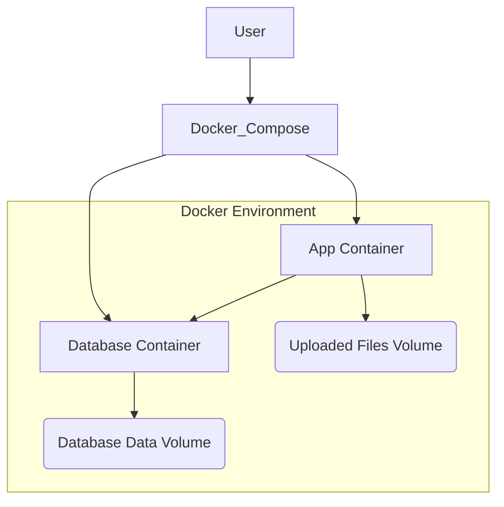

# Docker Setup Plan

This document outlines the plan for setting up Docker for the project, including the application Dockerfile, docker-compose.yml for orchestration, handling of file uploads with volumes, and necessary environment variables.

## 1. Dockerfile for the Application

This Dockerfile will build the image for the FastAPI application.

```dockerfile
# Use an official Python runtime as a parent image
FROM python:3.9-slim

# Set the working directory in the container
WORKDIR /app

# Copy the current directory contents into the container at /app
COPY . /app

# Install any needed packages specified in requirements.txt
# Since you don't have requirements.txt, we'll install directly
RUN pip install --no-cache-dir fastapi sqlalchemy psycopg2-binary uvicorn python-multipart

# Make port 8000 available to the world outside this container
EXPOSE 8000

# Run the application
# Use gunicorn with uvicorn workers for production
CMD ["uvicorn", "app.main:app", "--host", "0.0.0.0", "--port", "8000"]
```

**Explanation:**

*   We start with a slim Python 3.9 image to keep the image size down.
*   The working directory is set to `/app`.
*   All project files are copied into the container.
*   Dependencies are installed using `pip`. I've included `uvicorn` and `python-multipart` as they are commonly used with FastAPI for serving and file uploads, respectively.
*   Port 8000 is exposed, which is the default port for Uvicorn.
*   The `CMD` instruction specifies how to run the application using `uvicorn`.

## 2. docker-compose.yml for Orchestration

This file will define and manage the application and database services.

```yaml
version: '3.8'

services:
  app:
    build: .
    ports:
      - "8000:8000"
    environment:
      # Database connection details
      DATABASE_URL: postgresql://user:password@db:5432/db_name
      # File upload directory
      UPLOAD_DIRECTORY: /app/uploads/images
    volumes:
      # Mount a volume for persistent file storage
      - uploaded_files:/app/uploads/images
    depends_on:
      - db

  db:
    image: postgres:13
    environment:
      POSTGRES_USER: user
      POSTGRES_PASSWORD: password
      POSTGRES_DB: db_name
    volumes:
      # Mount a volume for persistent database data
      - db_data:/var/lib/postgresql/data

volumes:
  uploaded_files:
  db_data:
```

**Explanation:**

*   We define two services: `app` and `db`.
*   The `app` service builds from the local Dockerfile (`build: .`).
*   Ports are mapped so the application is accessible on `localhost:8000`.
*   Environment variables `DATABASE_URL` and `UPLOAD_DIRECTORY` are set. These will be used by the application to connect to the database and determine the file upload location.
*   A volume named `uploaded_files` is mounted to `/app/uploads/images` inside the container. This ensures that uploaded files persist even if the container is removed.
*   `depends_on: - db` ensures the database container starts before the application container.
*   The `db` service uses the official `postgres:13` image.
*   Environment variables are set for PostgreSQL user, password, and database name. **Remember to replace `user`, `password`, and `db_name` with your desired values.**
*   A volume named `db_data` is mounted to `/var/lib/postgresql/data` for persistent database storage.
*   The `volumes` section defines the named volumes used by the services.

## 3. Handling File Uploads with Docker Volumes

The current `app/services/file_handler.py` uses a hardcoded relative path `./uploads/images`. To work correctly with the Docker volume setup, this needs to be updated to read the upload directory from the `UPLOAD_DIRECTORY` environment variable.

**Proposed change in `app/services/file_handler.py`:**

Modify the `UPLOAD_DIR` definition to read from the environment variable, with a fallback for local development.

```python
import os
# ... other imports ...
from pathlib import Path

# Configuration
# Use a directory specified by environment variable, fallback to relative path
UPLOAD_DIR = Path(os.getenv("UPLOAD_DIRECTORY", "./uploads/images"))
# ... rest of the file ...
```

This change makes the upload directory configurable via the `docker-compose.yml` file.

## 4. Environment Variables and Configuration

*   `DATABASE_URL`: This environment variable in the `app` service will contain the connection string for the PostgreSQL database. The hostname `db` is used because that's the name of the database service in `docker-compose.yml`.
*   `UPLOAD_DIRECTORY`: This new environment variable will be used by the application to determine the path where uploaded files should be stored within the container. This path corresponds to the mount point of the `uploaded_files` volume.
*   PostgreSQL Environment Variables (`POSTGRES_USER`, `POSTGRES_PASSWORD`, `POSTGRES_DB`): These are standard PostgreSQL environment variables used to initialize the database when the container is first created.

## Mermaid Diagram



## Summary of Planned Files:

*   [`Dockerfile`](Dockerfile): Defines how to build the application image.
*   [`docker-compose.yml`](docker-compose.yml): Orchestrates the application and database containers and defines volumes.

## Required Code Modification:

*   Modify [`app/services/file_handler.py`](app/services/file_handler.py) to read the upload directory from an environment variable.